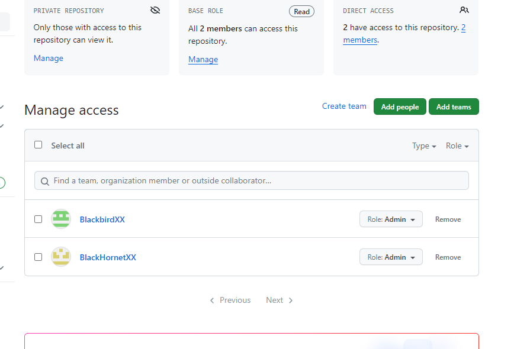
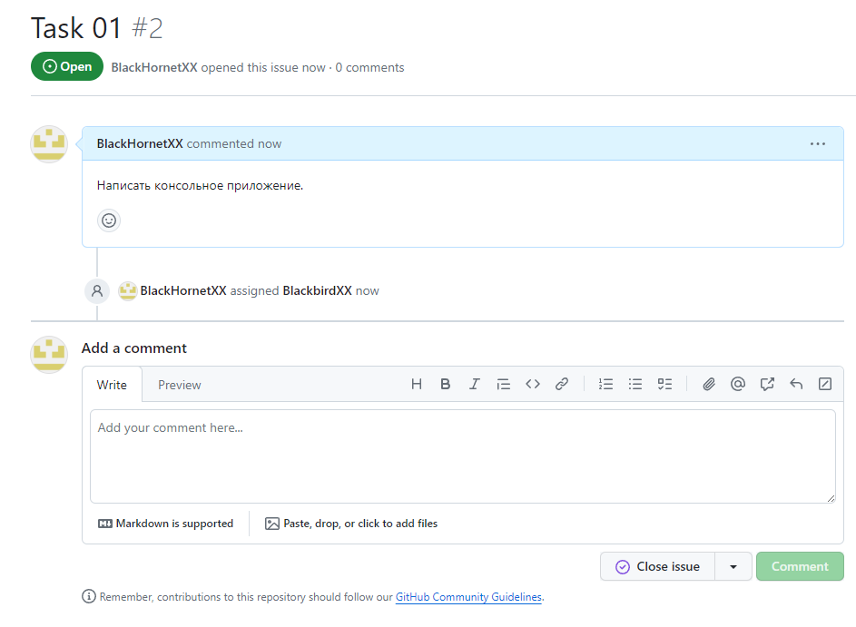
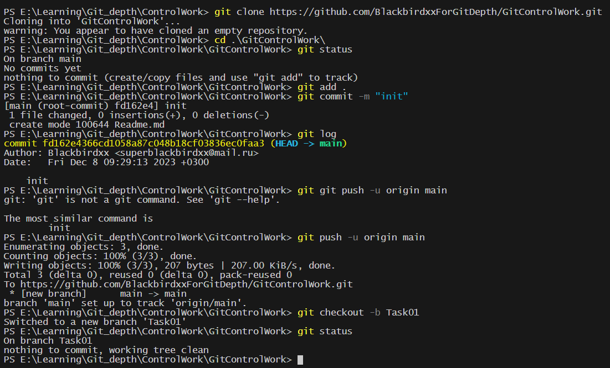
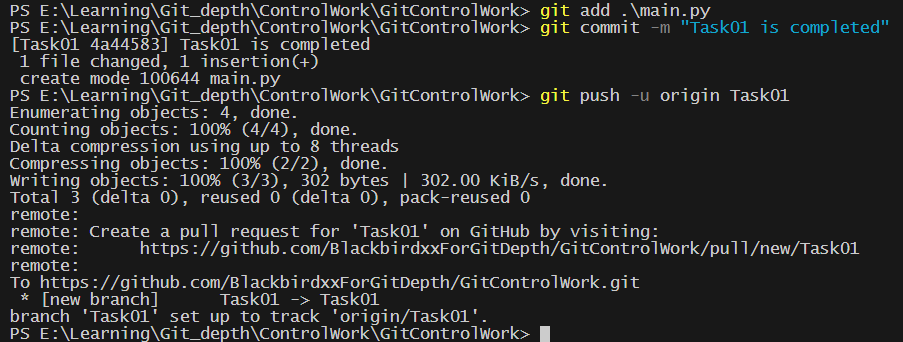
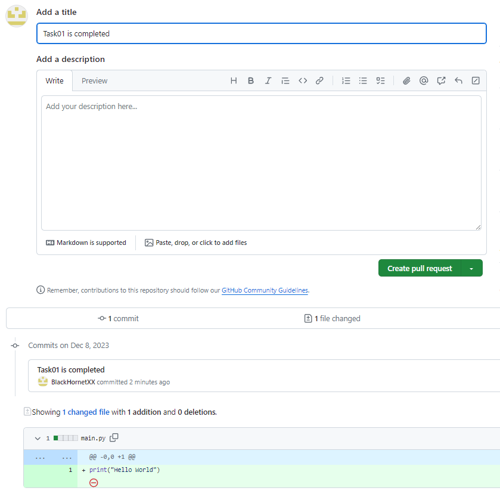
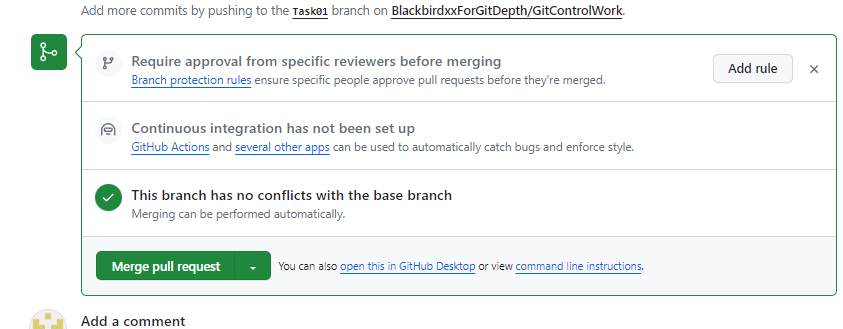
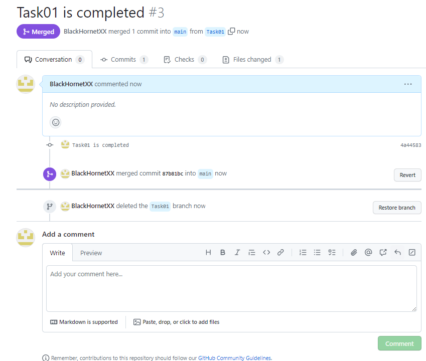
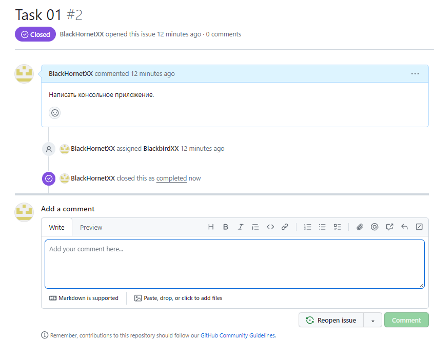
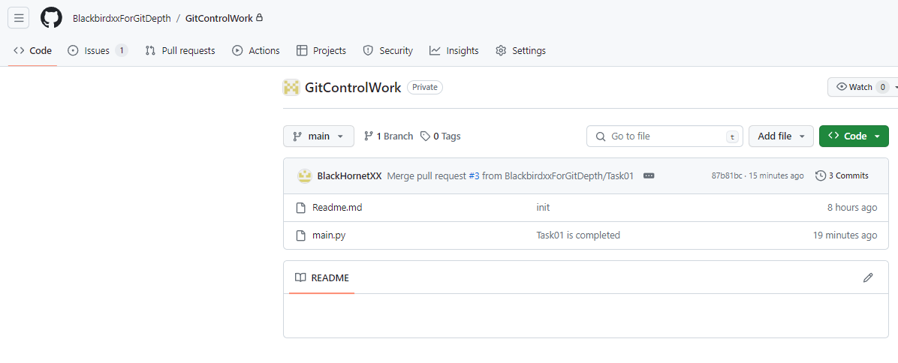

### Создаем организацию и удаленный репозиторий в ней. Приглашаем второго члена организации и даем ему доступ к репозиторию.

### Создаем задачу для исполнителя.

### Исполнитель клонирует репозиторий, создает новую ветку и пишет в ней код.

### После написания приложения исполнитель пушит свою рабочую ветку.

### Тимлид видит выполненую задачу.

### Объединение с основной веткой.

### Удаление уже не нужной ветки Task01.

### Закрываем задачу.

### Основная ветка объединенная с побочной Task01.

### P.S. К сожалению работу выполнял за пару часов до дедлайна. Времени на поиск напарника не было. Поэтому создал второй аккаунт на гитхабе и сам себе ставил задачи.